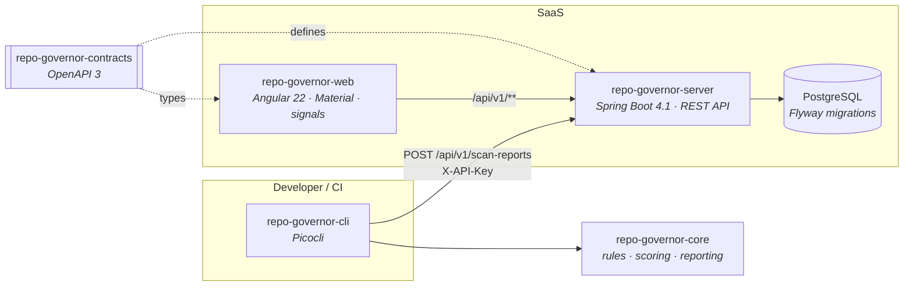

<div align="center">

# 🛡️ Repo Governor

**Scan. Score. Improve.**

*A developer governance platform that scans repositories and scores them on engineering maturity — so developers, tech leads and engineering managers keep every repo healthy, secure, maintainable and consistent.*

[](https://github.com/ChrisvDalen/repo-governor/actions/workflows/ci.yml)


</div>

---

## ✨ What it does

```
 $ repo-governor scan . --upload --server http://localhost:8080 --api-key dev-api-key

 Scanned my-service — overall score 73/100
   REPO_HEALTH     90        Findings: 0 blocker, 2 major, 3 minor, 1 info
   JAVA            85        Reports written to ./repo-governor-report.{json,md}
   SPRING_BOOT     70        Report uploaded to http://localhost:8080
   SECURITY        55
   ...
```

One command scans a repository against **24 governance rules**, writes a JSON + Markdown
report, uploads it to the dashboard — and fails your CI build when thresholds are violated.
The dashboard turns those scans into organization-wide insight: scores, trends, findings,
triage and concrete improvement actions.

| | CLI | | Dashboard |
|---|---|---|---|
| 🔍 | Scans any repo, local or in CI/CD | 📊 | Repo health per organization / team / repository |
| 📄 | JSON + Markdown reports | 📈 | Score trends: improving & degrading repos |
| 🚦 | Threshold-based exit codes (CI gate) | 🩺 | Findings with triage: accept risk / resolve |
| ☁️ | One-flag upload to the dashboard | 🔬 | Scan-to-scan diff: new & resolved findings |

## 🏗️ Architecture



| Module | Stack | Purpose |
|---|---|---|
| [`repo-governor-core`](repo-governor-core) | Plain Java — **zero Spring** | Domain model, 24 scan rules, scoring engine, JSON/Markdown reporting |
| [`repo-governor-cli`](repo-governor-cli) | Picocli | `init` · `scan` · `report` · `upload` · `rules list` |
| [`repo-governor-server`](repo-governor-server) | Spring Boot 4.1 · PostgreSQL · Flyway | REST API, API-key auth, scan storage & diffing, dashboard aggregation |
| [`repo-governor-web`](repo-governor-web) | Angular 22 · Material · signals | The SaaS dashboard |
| [`repo-governor-contracts`](repo-governor-contracts) | OpenAPI 3 | Contract-first API definition, served at `/api/docs/openapi.yaml` |

**Design rules, enforced by ArchUnit:** controllers never touch Spring Data repositories or JPA
entities (DTOs only at API boundaries), and the server never depends on CLI/core code — the JSON
report is the only coupling. In core: rules return `Finding`s and never print, reporting is
decoupled from scanning, and all file access goes through the `RepoFiles` abstraction so every
rule is unit-testable in memory.

## 🚀 Quick start

**Prerequisites:** JDK 25+, Node.js 22+, Docker.

```bash
# 1. Backend — seeds organization 'demo-org' with API key 'dev-api-key'
docker compose up -d postgres
./gradlew :repo-governor-server:bootRun

# 2. Frontend — http://localhost:4200, /api proxied to :8080
cd repo-governor-web && npm install && npm start
#    → open http://localhost:4200/settings and enter: dev-api-key

# 3. CLI
./gradlew :repo-governor-cli:installDist
alias repo-governor=$PWD/repo-governor-cli/build/install/repo-governor/bin/repo-governor

# 4. Scan & upload any repository
repo-governor scan ../some-demo-repo --upload --server http://localhost:8080 --api-key dev-api-key

# 5. Watch it appear on the dashboard 🎉
open http://localhost:4200
```

<details>
<summary><b>…or run everything in Docker</b></summary>

```bash
docker compose up --build     # dashboard on http://localhost:8081
```
</details>

<details>
<summary><b>Prefer a single jar for the CLI?</b></summary>

```bash
./gradlew :repo-governor-cli:fatJar
java -jar repo-governor-cli/build/libs/repo-governor-cli-0.1.0-all.jar scan .
```
</details>

## 🧰 CLI reference

```bash
repo-governor init [path]            # generate repo-governor.yml
repo-governor scan [path]            # scan → repo-governor-report.json + .md
repo-governor scan . --upload --server URL --api-key KEY
repo-governor report [path]          # print last report (--format json|markdown)
repo-governor upload [path] --api-key KEY [--server URL] [--file report.json]
repo-governor rules list             # all 24 rules with category & severity
```

`scan` exits with code `2` when thresholds are violated — drop it straight into your pipeline:

```yaml
- name: Governance gate
  run: repo-governor scan . --upload --server $GOVERNOR_URL --api-key ${{ secrets.GOVERNOR_KEY }}
```

## ⚙️ Configuration — `repo-governor.yml`

```yaml
project:
  name: example-service
  type: auto
  organization: demo-org
  team: platform
server:
  url: http://localhost:8080
rules:
  enabled: []            # empty = all rules; otherwise an allowlist of rule ids
  disabled: []           # always-skip list
thresholds:
  overall: 70            # minimum overall score, else exit code 2
  blockerAllowed: false  # any BLOCKER finding fails the scan
```

## 📐 Rules & scoring

Rules cover nine categories — `REPO_HEALTH` · `JAVA` · `SPRING_BOOT` · `ANGULAR` ·
`API_CONTRACT` · `CI_CD` · `SECURITY` · `AI_READINESS` · `DOCUMENTATION` — from README and
CODEOWNERS checks, JUnit/ArchUnit presence and Spring layering smells, to committed `.env`
files, hard-coded secrets, missing CI test steps and AI-assistant readiness (`AGENTS.md`,
copilot instructions).

**Only relevant categories count.** Technology detection (Maven/Gradle, Spring Boot, Angular,
OpenAPI, pipelines…) decides which categories apply, so a pure Angular repo is never punished
for missing JUnit. Each relevant category starts at 100 and loses points per finding:

| Severity | Penalty |
|---|---|
| 🔴 BLOCKER | −45 |
| 🟠 MAJOR | −15 |
| 🟡 MINOR | −5 |
| ⚪ INFO | −1 |

The overall score is the average of the relevant category scores.

## 🔌 API

Contract-first: [`repo-governor-contracts/openapi.yaml`](repo-governor-contracts/openapi.yaml).
Every endpoint requires an `X-API-Key` header, which resolves to an organization and scopes all data.

| Endpoint | Purpose |
|---|---|
| `POST /api/v1/scan-reports` | Upload a CLI scan report |
| `GET /api/v1/repositories` · `GET /api/v1/repositories/{id}` | Repo overview & detail |
| `GET /api/v1/repositories/{id}/scans` | Scan history |
| `GET /api/v1/repositories/{id}/findings?severity=&category=&status=` | Filterable findings |
| `GET /api/v1/scans/{id}` · `GET /api/v1/scans/{id}/diff` | Scan detail & diff with previous scan |
| `PATCH /api/v1/findings/{id}/status` | Triage: `OPEN` / `ACCEPTED_RISK` / `RESOLVED` |
| `GET /api/v1/organizations/{id}/dashboard` | Organization summary: score, counts, worst/improving/degrading repos |
| `GET /api/v1/rules` · `PATCH /api/v1/rules/{id}/configuration` | Rules & per-organization configuration |

Triage status is **carried over**: when a new scan reports a finding that was already accepted
or resolved in the previous scan, its status survives the re-scan.

## 🧪 Testing

```bash
./gradlew test       # unit tests: rules, scoring, config, CLI upload + ArchUnit
./gradlew build      # + Testcontainers integration test (needs Docker)
cd repo-governor-web && npm run build
```

`ScanUploadFlowIT` boots PostgreSQL via Testcontainers and exercises the entire slice:
upload → repository list → finding filters → triage → second upload → diff → dashboard → rule
configuration.

## 🐶 Dogfooding

This repository scans itself — `repo-governor.yml` sits at the root and the
scanner currently rates this repo **98/100**. During development the self-scan even caught a
(false-positive) layering finding in its own controller, which led to a better heuristic and a
clean `+2` score delta in the scan diff. The tool works on the tool. 🎯

## 🗺️ Roadmap

- [ ] OAuth/OIDC authentication (API keys are the MVP mechanism)
- [ ] Generated Angular API client from the OpenAPI contract
- [ ] Per-organization rule sets applied server-side to uploaded reports
- [ ] Deeper rules: dependency CVE checks, coverage thresholds, monorepo awareness
- [ ] Historical score charts & team-level dashboards
